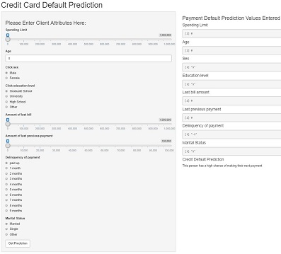

--- .class #id 

## Introduction Credit Card Payment Default Application 
The credit card prediction application can aid in risk managers determing when clients will default on their next payment.

This presentation is part of the Coursera Developing Data Products Course Final.

This presentation goes over the following topics: 
* Background
* Product pitch
* Data Analysis
* Application Interface

---

## Background
The dataset that was used as the prediction algorithm can found at:

https://archive.ics.uci.edu/ml/datasets/default+of+credit+card+clients#

The application for the assignment us available at:

#

The Source code for the ui.R and server.R files are on GitHub:

#

The slidify presentation on GitHub can be found at:

#

---

## The Pitch

The Credit Card Default Prediction application was developed with these goals in mind
* Download and analyze customer credit default data
* Run a logistic regression on the data creating a prediction algorithm
* Allow for the user to input new customer data and obtain a credit default prediction

Credit card default analysis requires large amounts of data to ensure a proper analysis is performed.  Feasibly this data is obtained from a companies internal data.  Credit card default is a large risk for credit companies.  Having the ability to predict which customers will default provides a measure of risk the company will face in the upcoming month. 

---

## Credit Default Data Analysis

The data subset used for the default analysis utilizes the following customer attributes
```{r echo=FALSE}
ccd<-read.csv('ccd.csv')

head(ccd[,c("default.payment.next.month","LIMIT_BAL","SEX","EDUCATION","MARRIAGE",
       "AGE","PAY_6","BILL_AMT6","PAY_AMT6")],3)
```
* PAY_6 is by the time of last bill how delinquent in months they are on their balance
* BILL_AMT6 is the amount of the bill
* PAY_AMT6 is the amount of the last bill paid

---

## Analysis Continued

The data is then used for logistic regression using the glm function in R.  The threshold for the logistic model is set at 50%.  The accuracy achieved was 78%.

Once this model is trained the user can input new parameters for the variables listed.

Once the user presses the submit button the application will output a prediction for client information given. 

---

## Credit Card Default Interface

The application has a paneled interface.  
The user inputs the parameters in the left side panel.
The main panel confirms the input by outputting the user inputs and displays the prediction




